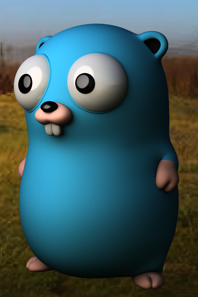
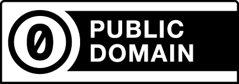

# Go Gopher model
A 3D model of the Go Gopher mascot. We ❤ Go.

> The Go gopher was created by renowned illustrator Renee French.
> It has become a beloved mascot for the Go brand. 
> The Gopher is a reminder of the approachability and 
> fun that comes with the Go brand and language.  
> [...]  
> But the gopher is not the logo.

Quote from [_Go brand book v1.0_](https://storage.googleapis.com/golang-assets/Go-brand-book-v1.9.5.pdf). 

## Project file structure

### 3D object directory

Original files (`3d-object/original`)

 * `go_gopher.mb`  The utterly original autodesk Maya file for the 3D gopher.
 * `go_gopher_high.obj`  An export of the maya 3D gopher as a vanilla wavefront OBJ file. (There is no `mtl` material sidecar file along with it.)

Colorized files (`3d-object/colorized`)
 * `go_gopher_color.blend` An import of the original `go_gopher_high.obj` to blender 3D editor (v3.1.2). The blender gopher is colorized according to the [vinyl toy palette](documentation/colors.md#vinyl-toy-colors).
 * `go_gopher_color.obj` An export wavefront `obj`-file export of the colorized blender gopher.
 * `go_gopher_color.mtl` A sidecar material file to the `go_gopher_color.obj` file. It contains the color definitions for the `obj`-file.

### 3D printable directory

 * `go_gopher_body.stl` 3D printable file for the gopher body. 
 * `go_gopher_eyes.stl` 3D printable file for the gopher eyeballs.

## Go-Gopher Colors

There seem to be a lot of freedom choosing colors for the Go Gopher.
But there are [color suggestions](documentation/colors.md) if you are looking for a classic original Go Gopher style.

## Examples

### Colorized obj-file

Object file: `3d-object/colorized/go_gopher_color.obj`  
Material file: `3d-object/colorized/go_gopher_color.mtl`

### Maya file

Maya file: `3d-object/original/go_gopher.mb`

### 3D printable (`3d-printable/go_gopher_xx.stl`)

[Creative Commons 0 ("public domain")  ](https://creativecommons.org/publicdomain/zero/1.0/) 

