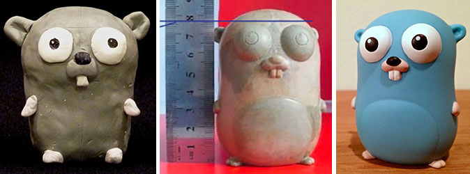

# Go Gopher Colors

It is not easy to find any official source stating the colors to be used for the Go Gopher mascot.

However, I found original the colors used for a vinyl Go Gopher toy in a presentation from the original creator of the mascot, [Renée French](https://en.wikipedia.org/wiki/Ren%C3%A9e_French).

The brand book for Go states a primary color named "Gopher blue".

A vectorized gopher in the brand book has yet another color.

To summarize, all the different colors originating from all kinds of "official" sources and the lack of explicit color definition gives a lot of freedom setting colors for your own gopher.

If you want a fair guess what the original color is supposed to be, you probably should take a look at the colors of the vinyl toy by as Renée French, the original designer, worked with the development of the toy and probably had a say in the colors used(?).

For other colors than blue for the mascot, perhaps a glance at the official Go colors from the brand book can be useful?

## Vinyl toy colors

_Image from [The Go Blog](https://go.dev/blog/gopher)_

A set of colors used for the Go Gopher can be found in a presentation from Renée French, the original creator of the mascot. She presents the colors used for a Go Gopher vinyl toy. She did not seem to disapprove of the colors the manufacturers used as she showed them in the presentation.

GopherCon 2016: [Renee French - The Go Gopher A Character Study](https://youtu.be/4rw_B4yY69k?t=414)

The colors are specified by PMS codes. The PMS codes are then converted to RGB values.

| Color name | Pantone PMS code |           RGB | RGB hex | Example                                          |
|------------|------------------|--------------:|--------:|--------------------------------------------------|
| Cyan       | PMS 305          |  89, 203, 232 |  59cbe8 |  |
| Black      | PMS 426          |    37, 40, 42 |  25282a |  |
| White      | white            | 255, 255, 255 |  ffffff |  |
| Pink       | PMS 7520         | 234, 190, 176 |  eabeb0 |  |

Color converter: [PMS to RGB](https://www.easycalculation.com/colorconverter/pantone-to-rgb.php)

## Go Gopher image in Go brand document

| Color name  |           RGB | RGB hex | Example                                          |
|-------------|--------------:|--------:|--------------------------------------------------|
| Body (blue) | 140, 210, 230 |  8cd2e6 |  |
| Skin (pink) | 244, 205, 202 |  f4cdca |  |

## Go brand colors

The color of the Go Gopher is mentioned in the [brand guide for Go (v1.0 as of 2022-06-06)](https://storage.googleapis.com/golang-assets/Go-brand-book-v1.9.5.pdf) (section 2.1) as "Gopher blue". Mind though that it is probably just a name for their blue brand primary color as the brand guide states that the gopher is not part of the Go brand but an embraced ("beloved") mascot.

Primary colors:

| Color name    | PMS code  |          RGB | RGB hex |           CMYK | Example                                          |
|---------------|-----------|-------------:|--------:|---------------:|--------------------------------------------------|
| *Gopher blue* | PMS 638C  |  1, 173, 216 |  00ADD8 |   73, 11, 7, 0 |  |
| Light blue    | PMS 310U  | 94, 201, 227 |  5DC9E2 |    56, 0, 9, 0 |  |
| Aqua          | PMS 3265C |  0, 162, 156 |  00A29C |  80, 14, 44, 0 |  |
| Black         | BLACKC    |      0, 0, 0 |  000000 | 75, 68, 67, 90 |  |

Accent colors:

| Color name  | PMS code  |          RGB | RGB hex |           CMYK | Example                                          |
|-------------|-----------|-------------:|--------:|---------------:|--------------------------------------------------|
| Fuchsia     | PMS 7635C |  206, 48, 98 |  CE3262 |  15, 95, 45, 1 |  |
| Yellow      | YELLOWC   |  253, 221, 0 |  FDDD00 |   2, 9, 100, 0 |  |

More colors:

| Color name   | PMS code     |           RGB | RGB hex |            CMYK | Example                                          |
|--------------|--------------|--------------:|--------:|----------------:|--------------------------------------------------|
| "Dark Aqua"  | PMS 3145C    |   0, 117, 141 |  00758D |   89, 42, 34, 7 |  |
| "Gray"       | PMS 425C     |    85, 87, 89 |  555759 |  65, 56, 53, 29 |  |
| "Light Gray" | Cool Gray 1C | 219, 217, 214 |  DBD9D6 |   13, 11, 12, 0 |  |
| "Purple"     | PMS 669C     |    64, 43, 86 |  402B56 |   82, 91, 37,31 |  |

(names are not specified for these colors but added here for description)

_Excerpt from [go brand guide](https://storage.googleapis.com/golang-assets/Go-brand-book-v1.9.5.pdf)_
